# COMSOL_OF_Semiconductor

## 0. Introduction

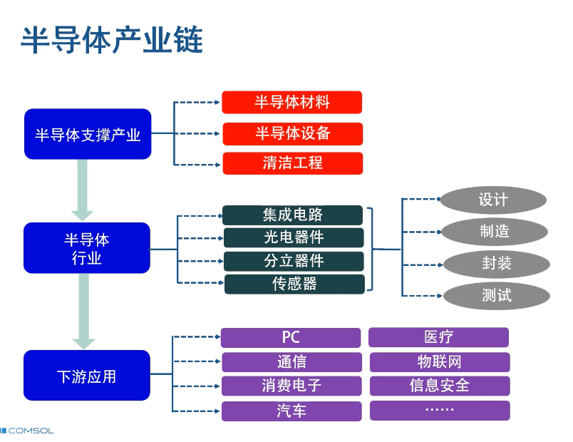

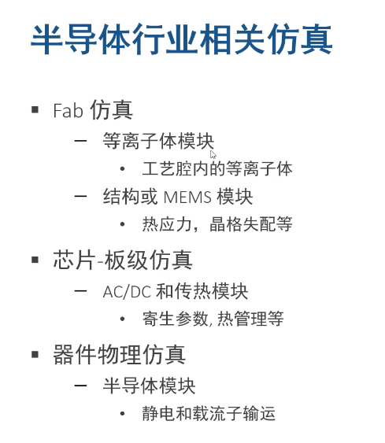

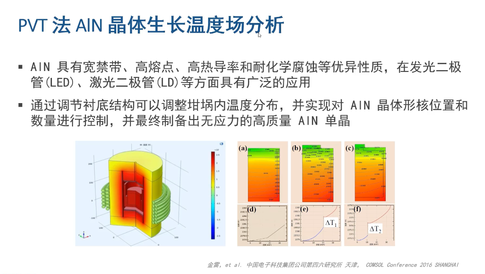

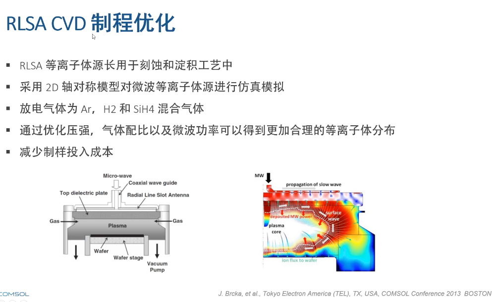

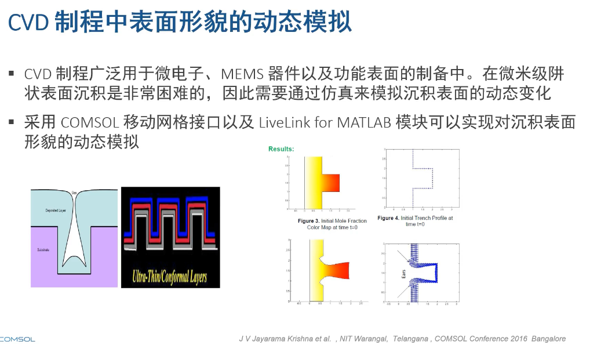

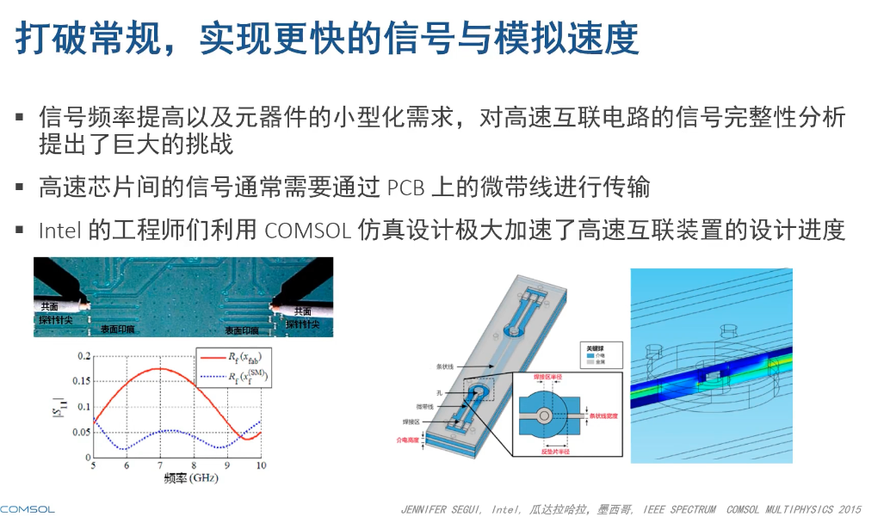

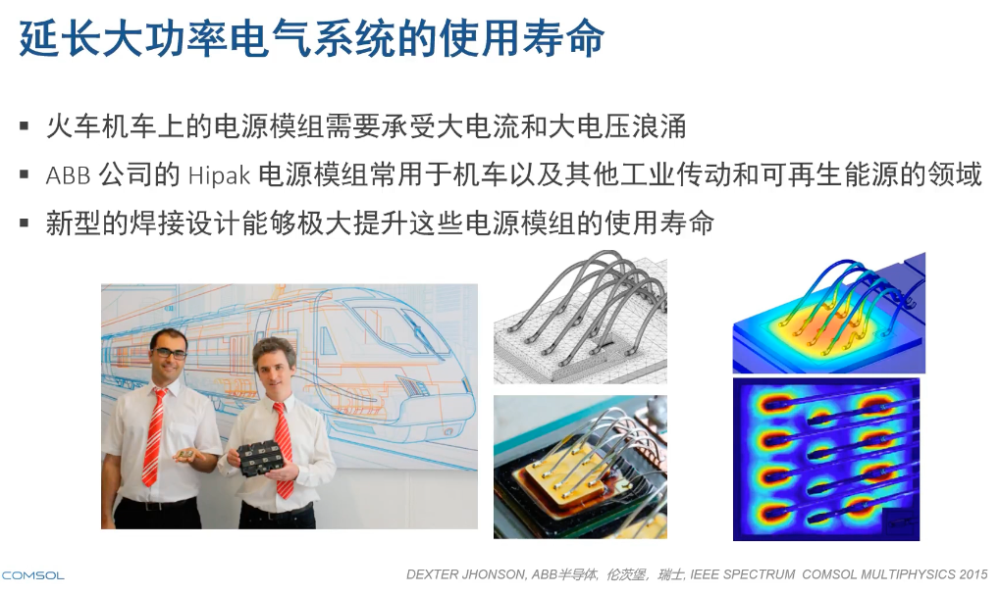

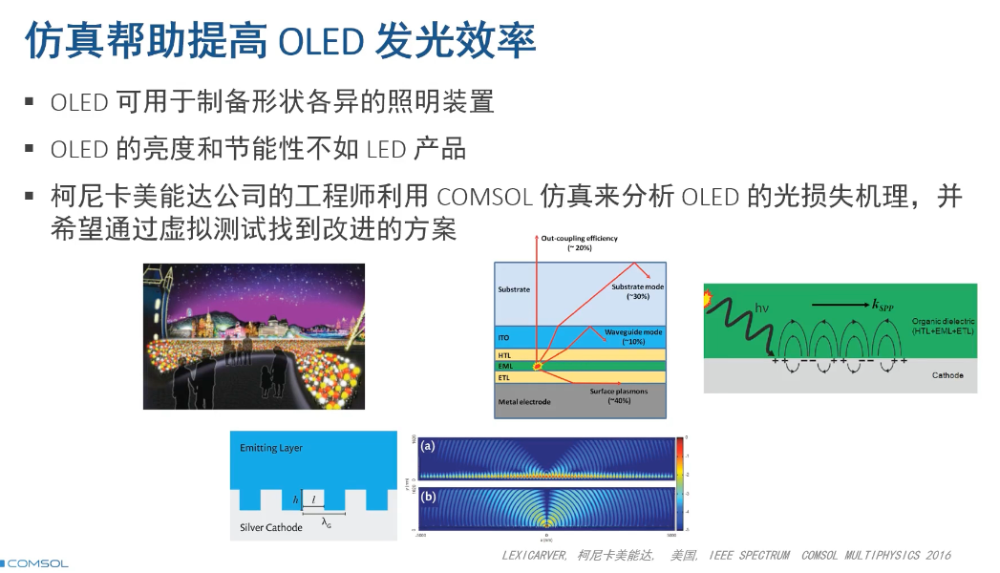

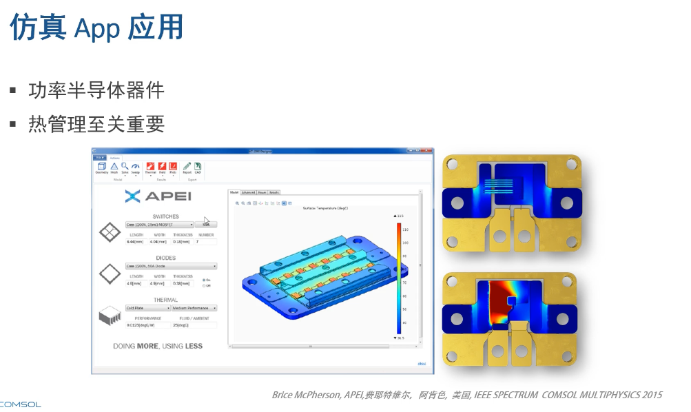

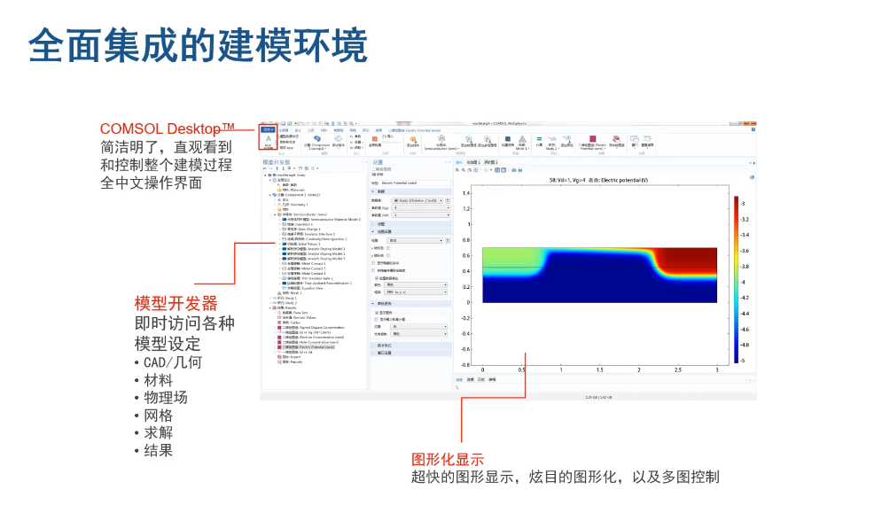

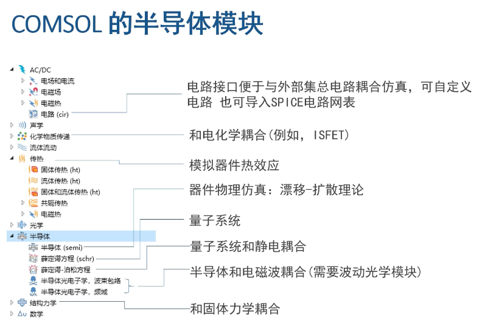

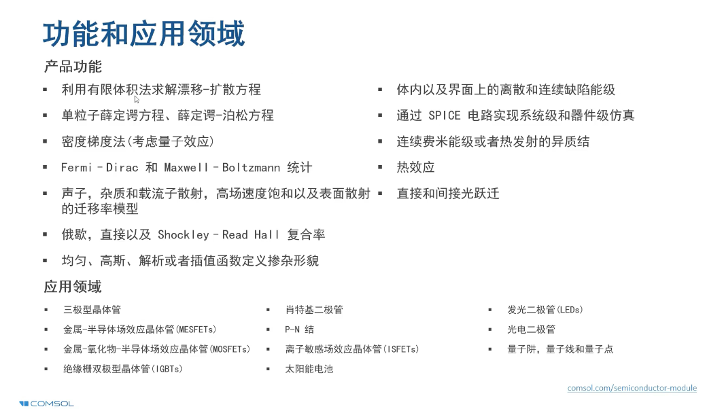

Link: https://www.comsol.com/semiconductor-module

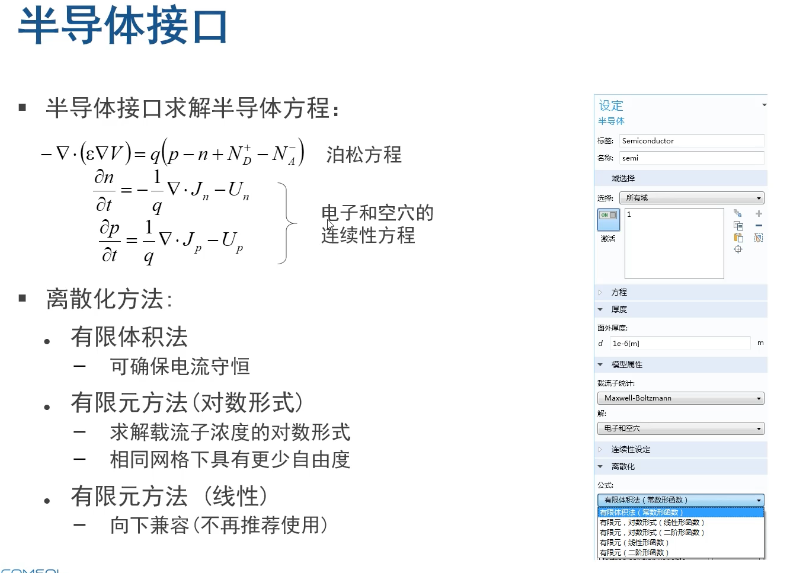

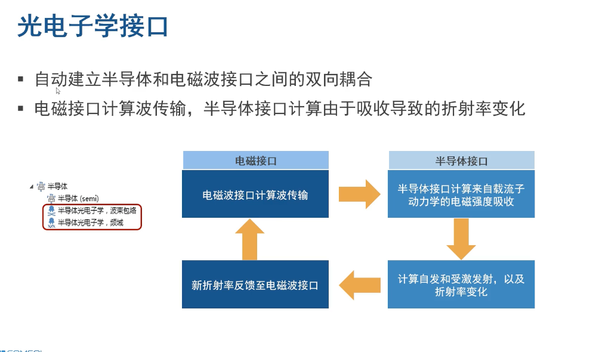

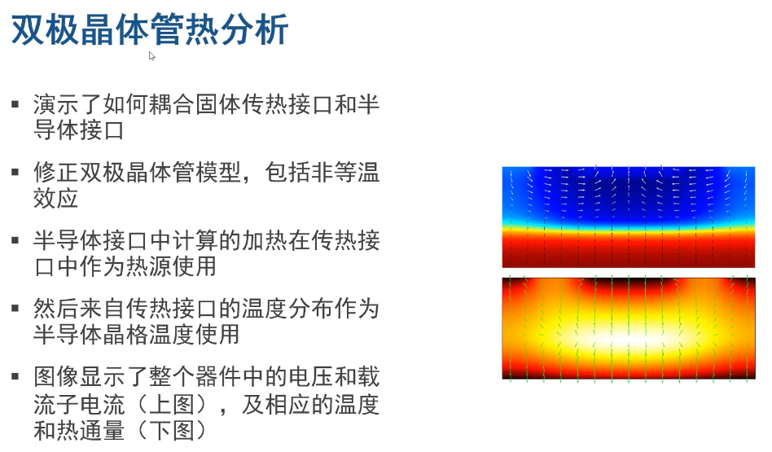

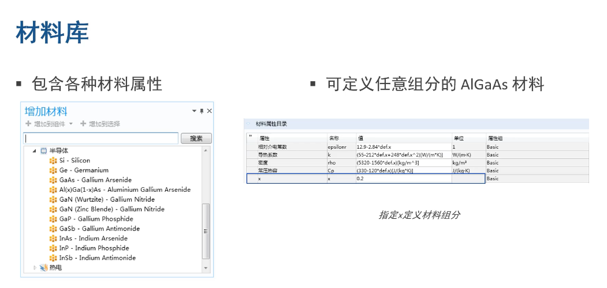

## 1.MOSFET器件案例

Link：http://cn.comsol.com/video/optimizing-semiconductor-device-performance-in-comsol-multiphysics-webinar-cn 第三十分钟

### 1.1 预先设置：

**半导体分析一般使用二维**，因为三维网格密度大，计算量大

二维研究，添加半导体结构，选择“稳态”研究。

### 1.2 设置参数：

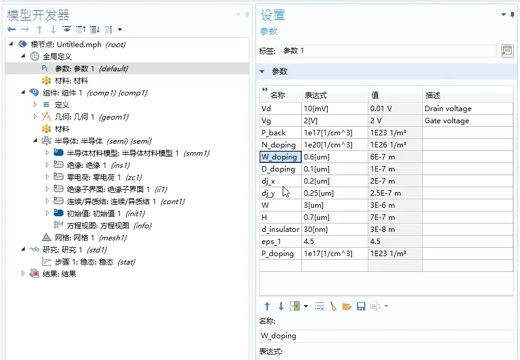