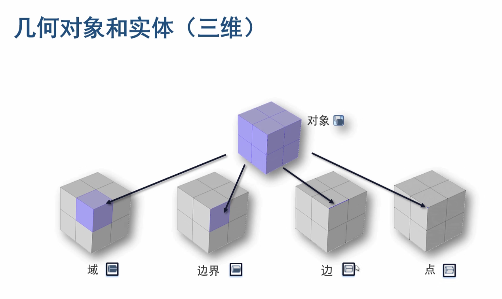

# Main note

## 1. 基础操作

目录：

* 基本操作示例
* 几何建模和CAD导入
* 网格剖分
* 研究类型及求解器简介
* 结果及后处理
* 常用函数

### 1.1 基本操作示例

#### 1.1.1 选择物理场界面

某某物理接口：在物理场选择中的某一个选项

建议一个个的加接口，方面后面查错。

#### 1.1.2 选择研究界面

具体模型具体分析

#### 1.1.3 建模界面

##### 模型开发器：参数

在COMSOL中，所有的单位都需要用[]括起来

##### 模型开发器：几何

在此处（或在工具栏）可以导入外部模型

点击设置中的“全部构建”显示所有的模型

所有之前设置的变量都会在登记在模型开发器中的“参数”中

##### 模型开发器：材料

右键单击，“从库中添加材料” ----> “内置材料” ----> 选择好后右键想添加的材料

如果库中没有想要的材料：右键单击“材料” ---> "空材料" ---> 自己设置属性参数

##### 模型开发器：组件1

右键此接口可以添加物理场

设置完后要和其他物理场进行耦合，在“多物理场”右键添加后来添加的物理场，然后选择适用的模型区域（一般是单击选择整个模型）

##### 模型开发器：某个接口（如“电流”）

已经存在的下拉列表是默认的条件，可以通过右键接口处添加其他条件（图标全填满的是域条件，半填满的是边界条件）

添加某个条件（如“接地”，边界条件），添加后点击模型选择接地的地方

在某点添加某个电压（选择“电势”，边界条件）

在未选择的模型的某一个part默认使用带“D”的接口默认条件，**要确认其他部分在默认条件下是否合理**，如果不合理，需要添加合理的条件去替代他

##### 模型开发器：网格

使用此选项对模型进行剖分

##### 模型开发器：研究

使用此选项对模型进行计算

显示变形和变形的的量：https://www.bilibili.com/video/BV1XE411P7hk?spm_id_from=333.337.search-card.all.click&vd_source=4eae4971dfe22b320ea4706b4ddcb436（第36分钟）

#### 1.1.4 App开发界面

##### app开发器：表单

右键新建表单，设置app的输入输出；通过“图形”添加其他输出的东西；通过“按钮”添加按钮。单击完成

##### 主界面

拖动模块改变其位置

### 1.2 几何建模和CAD导入

内核修改方法：在模型开发器的”几何“设置中修改

#### 1.2.1 序列

几何的下拉列表被称为“序列”

选择某一个序列，在设置中会有“构建选定对象”（构建第一个序列到选定序列），“构建全部对象”。实现的操作就是根据序列的设置构建模型。

右键可以禁用某个序列

#### 1.2.2 体素

使用“体素”可以创建基本的二维对象（圆，椭圆....）

#### 1.2.3 更多体素

使用“更多体素”可以创建基本的三维对象

#### 1.2.4 层

在某个序列的设置中会有层的选项，设置层的厚度，进行构建即可。

#### 1.2.5 2D ---> 3D

创建二维的结构需要先右键“几何”创建一个工作平面。

##### 拉伸

在工作平面上设置好二维图形后，**右键几何下面的“工作平面x”**，选择“拉伸”，设置高度在设置中的“距离”，构建对象。

##### 旋转

**右键“几何”** ---> "回旋"。（注意：旋转轴不能跟几何对象相交）移动旋转轴需要通过“设置”中的“旋转轴”进行旋转轴位置设置。

##### 扫掠

进行扫掠时需要有一条边：右键“几何” ---> 更多体素 ---> 线段，通过“设置”设置线段的位置信息

**右键“几何”** ---> "扫掠"。设置中的“横截面”设置要扫掠的面，“脊线”设置要跟随的边。 

上图中展示的扫掠需要设置一条“参数化曲线”并将圆形移动到曲线的最下端，再进行扫掠

#### 1.2.6 从三维中提取二维图形

右键“几何”创建工作平面，在设置中看设置平面类型（以什么为参照做平面，可以选择定点或者线），创建一个平面，添加一个组件，右键“组件2”，选择横截面。

#### 1.2.7 Bool操作

